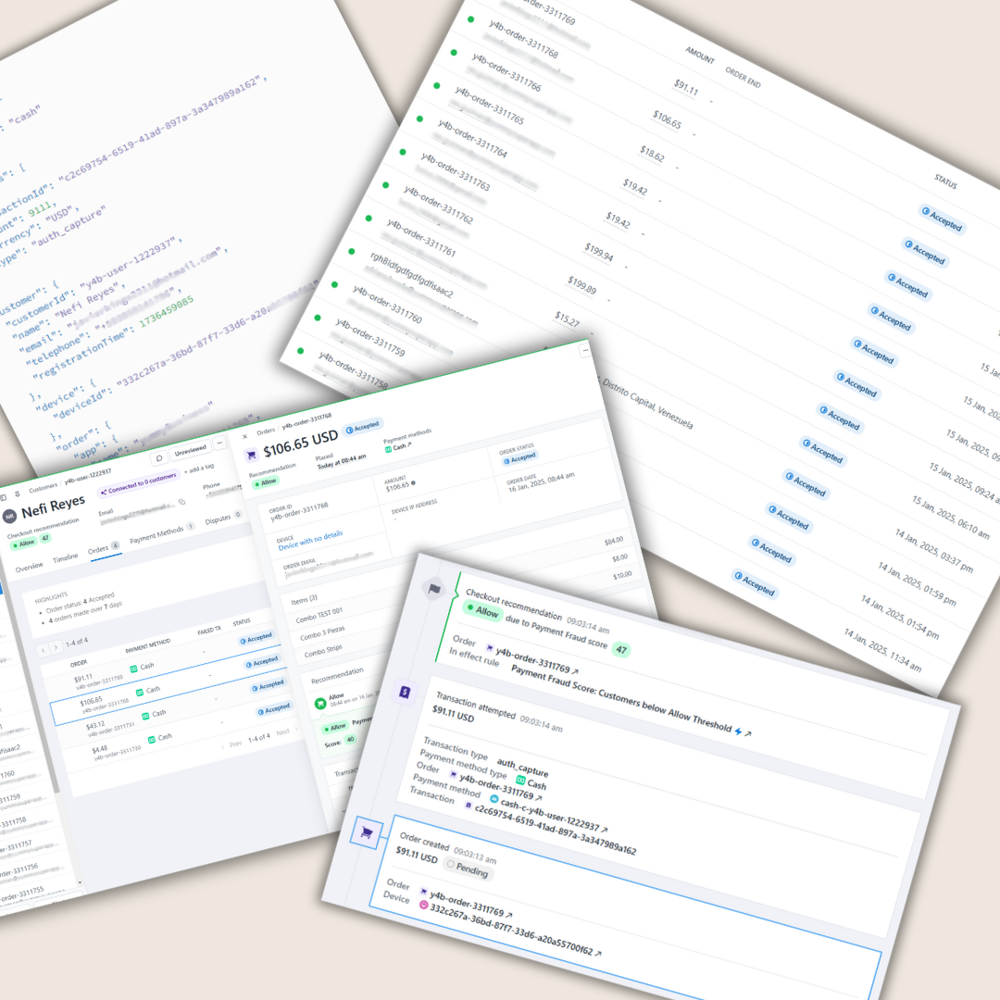

# Hugo: Payments Service

> At Hugo Technologies, I specialized in building and optimizing the Payments Service, a crucial component of the platform that handled all financial transactions across multiple countries.

### **Senior Backend Engineer \[Payments Service\] at Hugo Technologies**

**Role:** Senior Backend Engineer  
**Duration:** March 2020 – August 2021

**Description:**  
At Hugo Technologies, I specialized in building and optimizing the **Payments Service**, a crucial component of the platform that handled all financial transactions across multiple countries. My work ensured the secure, efficient, and seamless processing of payments for customers, drivers, and merchants within the Hugo ecosystem.

**Key Contributions:**

-   **Payment Gateway Integrations:** Integrated multiple third-party payment processors to support diverse payment methods, including credit/debit cards, digital wallets, and bank transfers, ensuring reliable and flexible payment options.
-   **Transaction Processing:** Engineered high-performance backend systems for processing thousands of transactions daily, focusing on security, speed, and accuracy.
-   **Fraud Detection:** Developed and implemented fraud detection algorithms to safeguard users and minimize financial risks for the platform.
-   **Settlement and Reconciliation:** Automated the settlement and reconciliation processes, ensuring timely payouts to drivers and merchants while maintaining accurate financial records.
-   **Cross-Border Payments:** Designed scalable solutions to handle multi-currency payments and cross-border financial operations, facilitating Hugo’s expansion into new markets.

**Key Achievements:**

-   Built a robust, scalable payments infrastructure that processed millions of dollars in transactions monthly with minimal downtime.
-   Reduced payment processing latency by 25% through system optimizations and efficient API integrations.
-   Implemented security best practices, including tokenization and encryption, to protect sensitive financial data and ensure PCI DSS compliance.
-   Enhanced system reliability and reduced errors by introducing thorough testing frameworks and real-time monitoring.

**Technologies Used:**

-   **Backend:** .NET, C#
-   **Database Management:** PostgreSQL, MongoDB
-   **Cloud Infrastructure:** AWS (S3, EC2, RDS), Azure
-   **Messaging & Tools:** RabbitMQ, Docker, Kubernetes

**Impact:**  
My contributions to Hugo’s Payments Service directly supported the company’s financial operations, enabling a seamless payment experience for users and ensuring the platform’s reliability as it scaled to meet increasing demand. My efforts played a key role in establishing trust and convenience in Hugo’s financial ecosystem.
