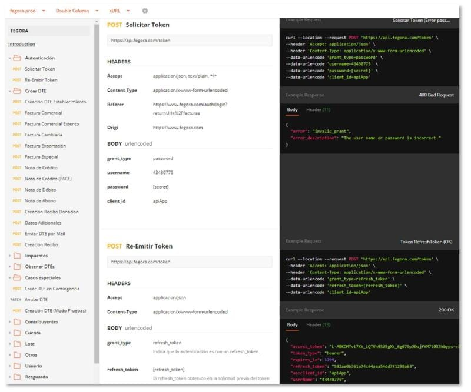
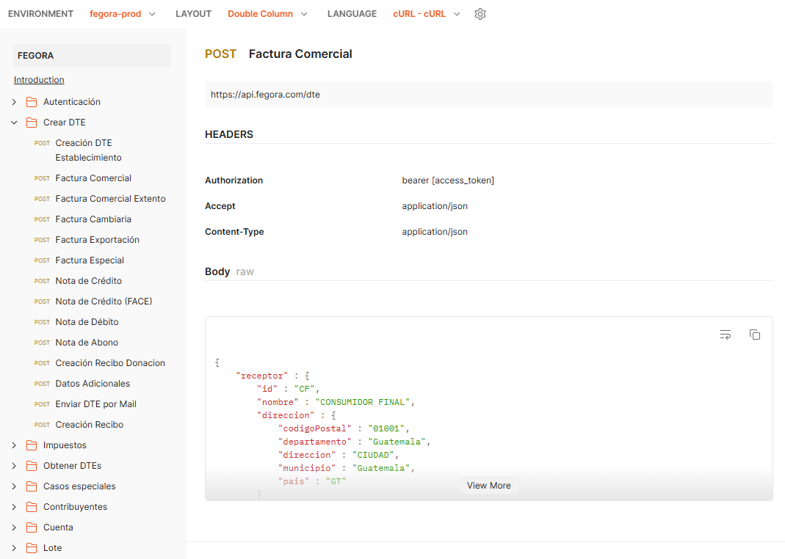
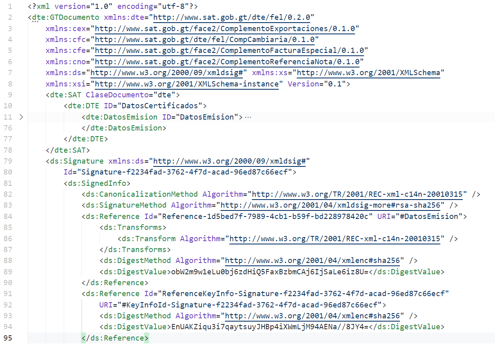
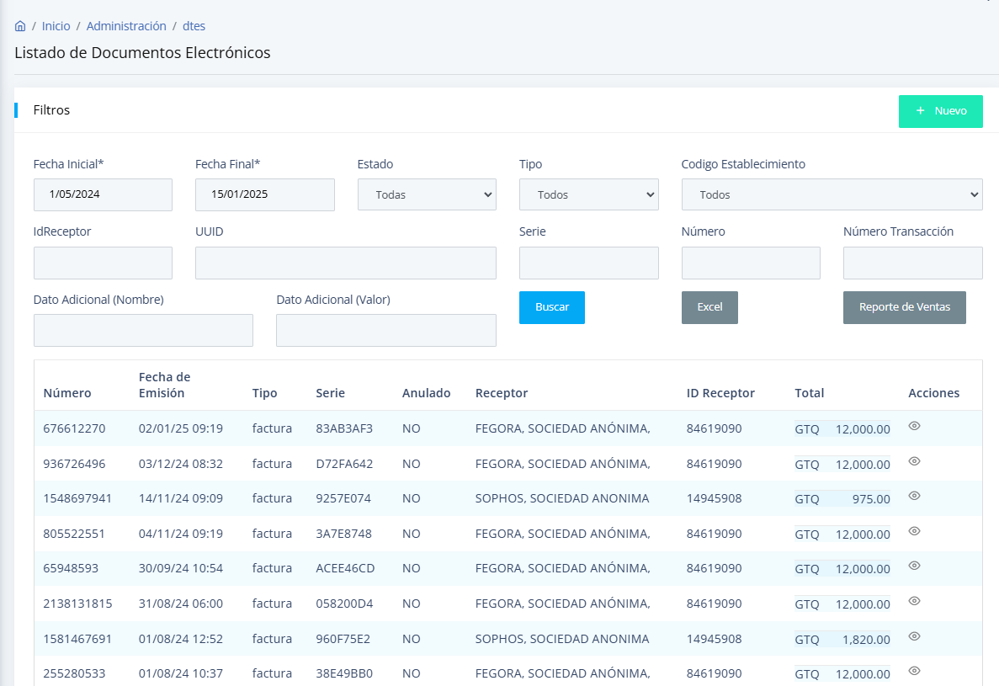
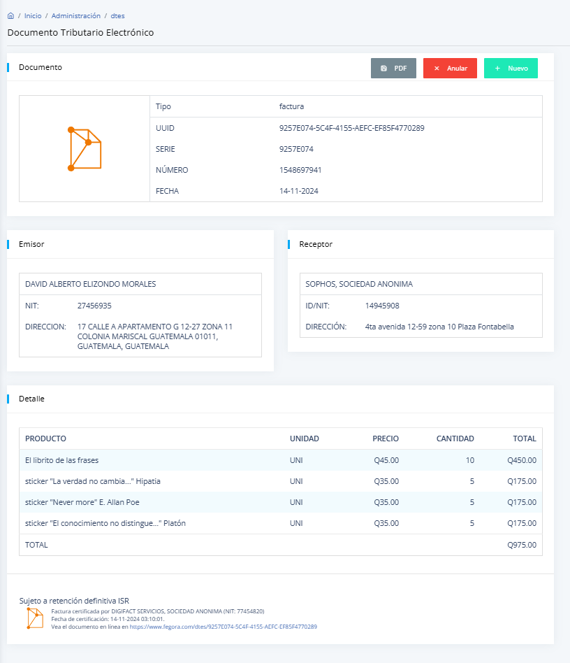
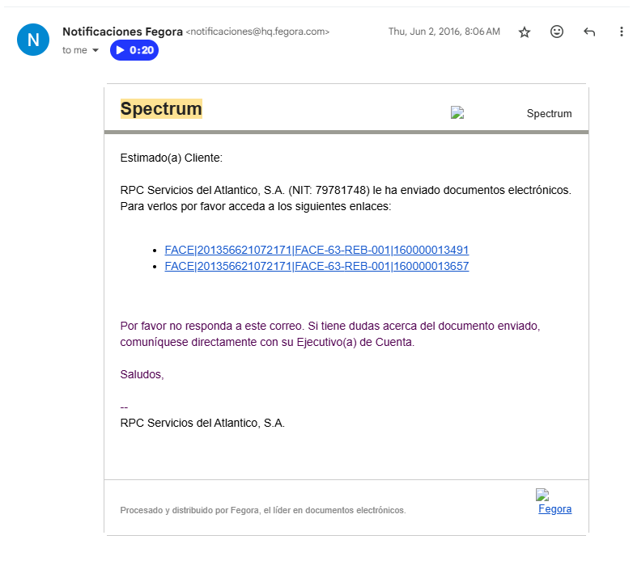

## **Co-Founder and Software Architect at Fegora**

**Description:**  
I co-founded **Fegora**, a pioneering digital invoicing platform that streamlined electronic invoicing processes for businesses in Guatemala and beyond. As a Software Architect, I designed and implemented scalable and innovative solutions that connected enterprise systems to the **Superintendency of Tax Administration (SAT)**, ensuring seamless compliance with government regulations.

**Key Contributions:**

-   **Software Architecture:** Designed and developed a robust, scalable architecture for digital invoicing services, ensuring high availability and fault tolerance.
-   **Regulatory Compliance:** Collaborated closely with the SAT to maintain compliance with evolving tax laws and standards, keeping client businesses operational and audit-ready.
-   **Client Integration:** Implemented flexible APIs and integration tools to connect Fegora’s platform with diverse client systems, enabling smooth adoption across various industries.
-   **User-Centric Features:** Developed intuitive user interfaces and tools that allowed businesses to efficiently manage invoicing, reporting, and document archiving.

**Key Achievements:**

-   Successfully scaled Fegora to handle high transaction volumes across multiple businesses.
-   Built a foundation that facilitated the platform's eventual acquisition, showcasing its market value and technological innovation.
-   Provided 15 years of technical customer support, ensuring a high level of client satisfaction and retention.
-   Created **custom LLBLGen Pro templates** and tools that optimized database design and performance for invoicing workflows.

**Technologies Used:**

-   **Backend:** .NET, C#
-   **ORM:** LLBLGen Pro
-   **Databases:** Microsoft SQL Server, Oracle, MySQL, PostgreSQL
-   **Additional Tools:** Visual Studio, REST APIs

**Impact:**  
Fegora revolutionized the invoicing landscape in Guatemala by providing businesses with a reliable, secure, and user-friendly platform for managing their digital invoices. My leadership and technical expertise were instrumental in establishing Fegora as a trusted name in the digital invoicing sector, empowering companies to transition to a digital-first approach.

With Fegora, businesses benefit from a robust RESTful API that allows for seamless integration with various applications and systems. The platform features a user-friendly web front that simplifies the invoicing experience, enabling users to create, send, and manage invoices effortlessly.

Fegora also excels in reporting capabilities, providing detailed insights into invoicing patterns and financial performance, which can help businesses make informed decisions. It supports a multitude of connector channels, including SMTP and SFTP for secure data transmission, as well as message queues for efficient processing.

* * *

Moreover, Fegora is compatible with a wide range of ERP systems, including SAP, Netsuite, Microsoft Dynamics, Odoo, Salesforce, and Shopify ensuring that companies can integrate their existing workflows without disruption. To facilitate development and customization, Fegora offers programming language client connectors for popular languages like .NET, JavaScript, Oracle PL/SQL, Python, and Ruby on Rails.

Overall, Fegora empowers Central American businesses and contributors to optimize their invoicing processes, improve cash flow management, and enhance operational efficiency through its versatile and reliable digital invoicing platform.

## Restful API

**[Fegora](https://developer.fegora.com/)**

Fegora hace accesible de una manera muy fácil la utilización de un API para realizar operaciones relacionadas con Facturación Electrónica en Línea (FEL). Dicho API está basado en un servicio REST con formato JSON para el intercambio de información. La configuración previa de la cuenta, hace que los datos que se deban enviar sean los estrictamente necesarios. Los cálculos, frases, firmas y demás complementos solicitados en los esquemas de SAT, son construidos, validados y sellados por el API de Fegora y el Certificador en cuestión. De manera inmediata se devuelve el documento certificado, con enlaces a los archivos XML y PDF para que la aplicación que se conecte los pueda bajar o guardar para posterior consulta de los receptores. A continuación se muestran los endpoints que expone el API, con algunos ejemplos adicionales para cada uno.

_Fegora API Reference_

## Json Structure

**[Estructura DTE](https://github.com/fegora/fegora.github.io/wiki/Estructura-DTE)**

Contribute to fegora/fegora.github.io development by creating an account on GitHub.

_Fegora json structure repository_

## Open source connectors

**[GitHub - fegora/fegora-dotnet: Conector o librería para clientes .NET4.5+ del API de Fegora](https://github.com/fegora/fegora-dotnet)**

Conector o librería para clientes .NET4.5+ del API de Fegora - fegora/fegora-dotnet

_Fegora .NET connector repository_
