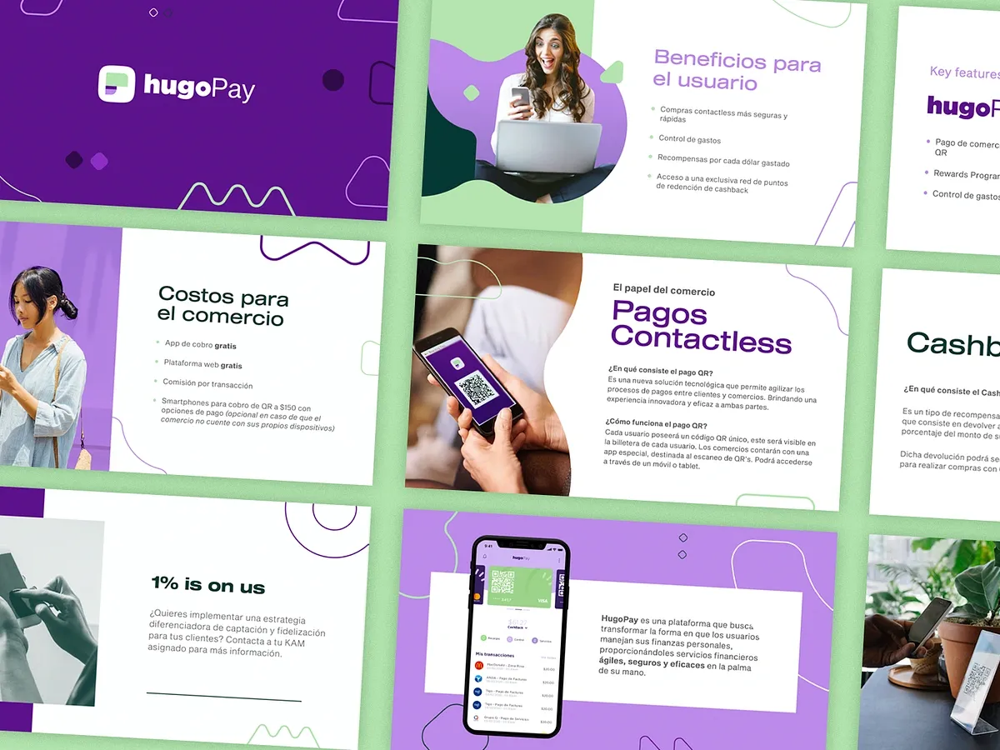
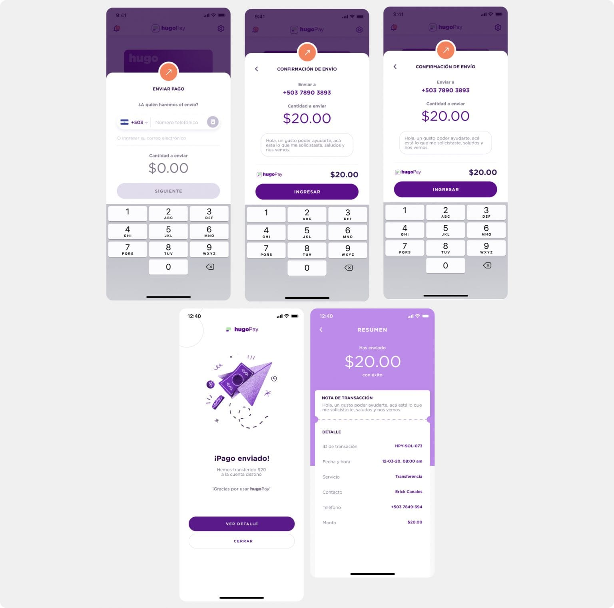
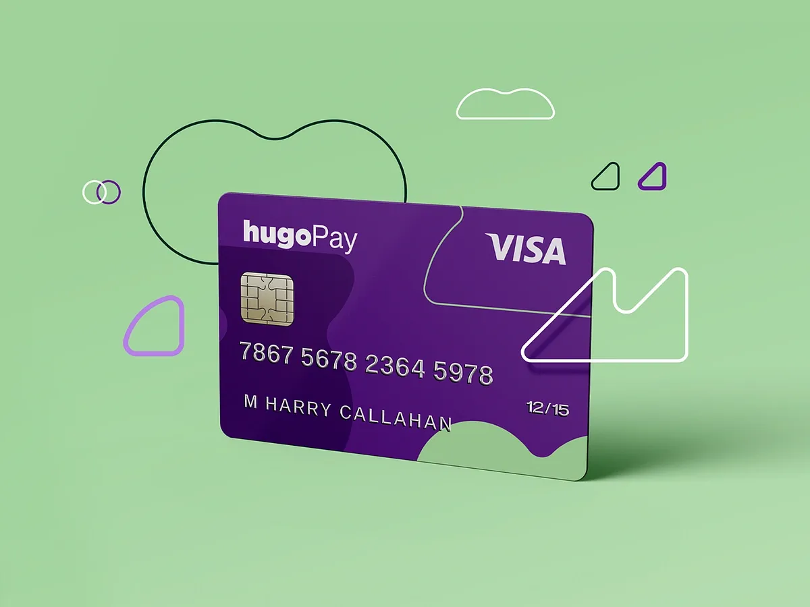
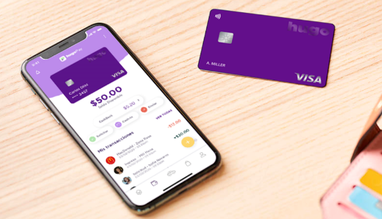
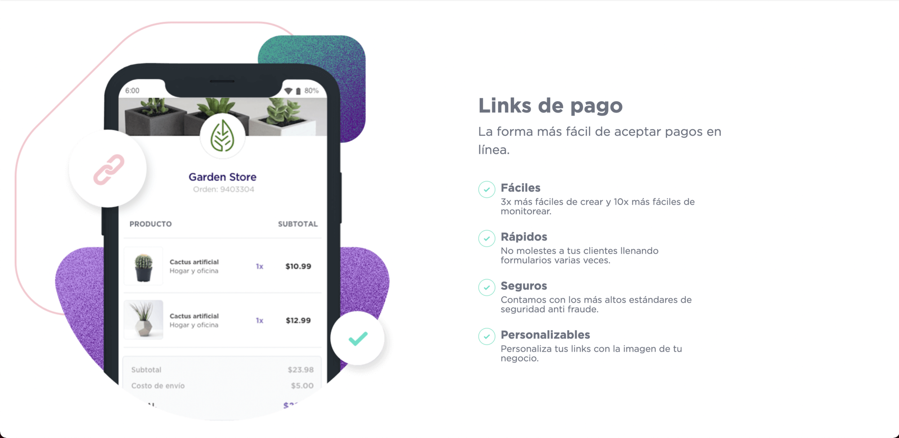

> As part of Hugo Technologies’ FinTech team, I focused on developing and scaling the **HugoPay Wallet**, an innovative digital wallet solution enabling seamless financial transactions for users, drivers, and merchants. My role involved building secure and efficient backend systems to support Hugo’s mission of empowering cashless transactions in emerging markets.

## **Key features**

-   **Wallet Management:** Designed and developed backend services to handle digital wallet functionalities, including deposits, withdrawals, transfers, and balance tracking.
-   **Integration with Payment Systems:** Integrated the wallet with external payment gateways and internal systems to support a variety of funding and payout options, enhancing flexibility and user convenience.
-   **Real-Time Transactions:** Built scalable solutions to process real-time wallet transactions with low latency and high reliability, ensuring a smooth user experience.
-   **Security and Compliance:** Implemented robust security measures, including encryption, tokenization, and secure authentication, to protect sensitive user data and comply with FinTech regulations.
-   **User Engagement Features:** Enabled features such as cashback rewards, promotions, and loyalty program integrations to drive user engagement and wallet adoption.

## **Impact**  

The HugoApp Wallet became a cornerstone of the Hugo ecosystem, offering users a secure and seamless digital payment experience. My contributions to its backend architecture ensured scalability, reliability, and regulatory compliance, positioning Hugo as a leader in digital financial services in the region.
