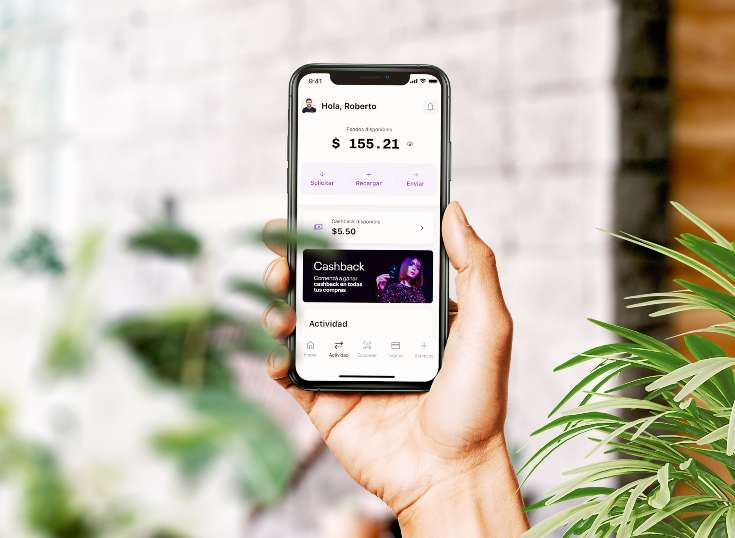
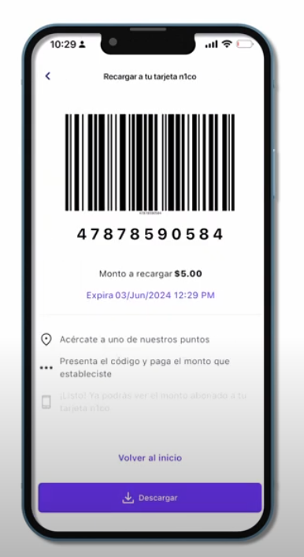
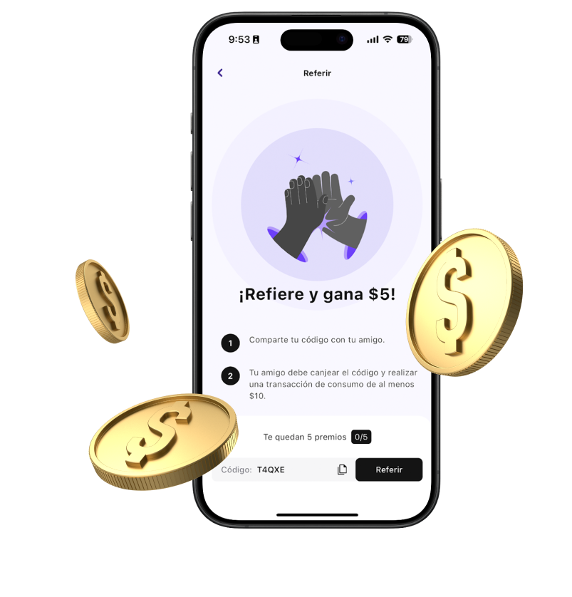
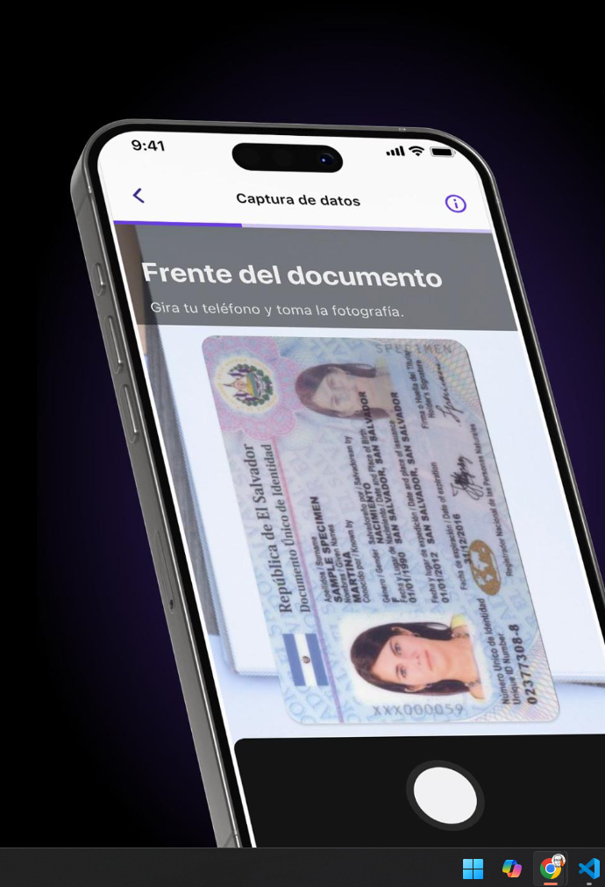
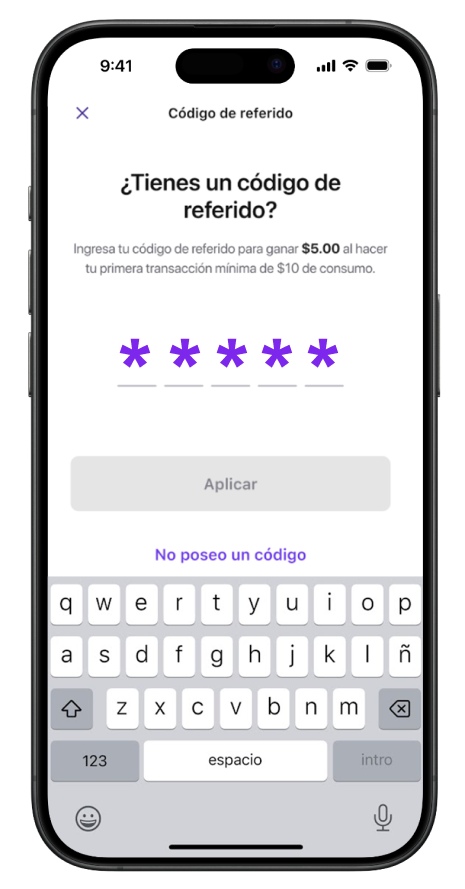
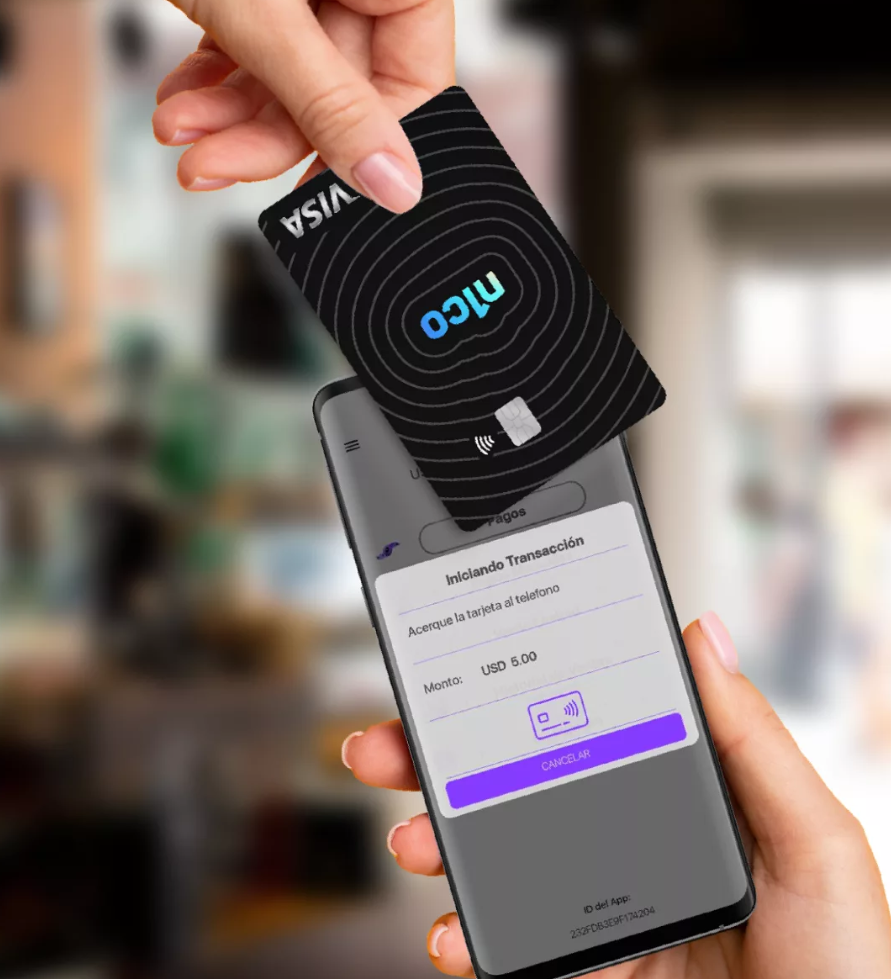
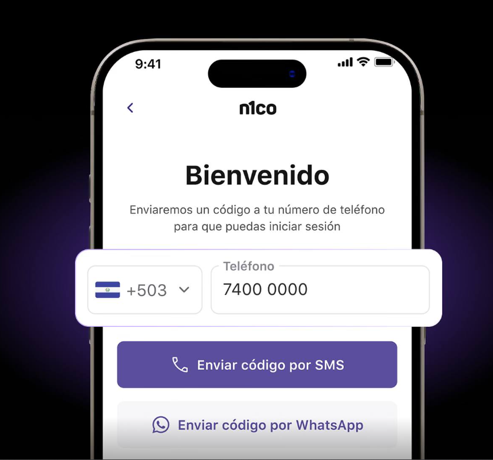
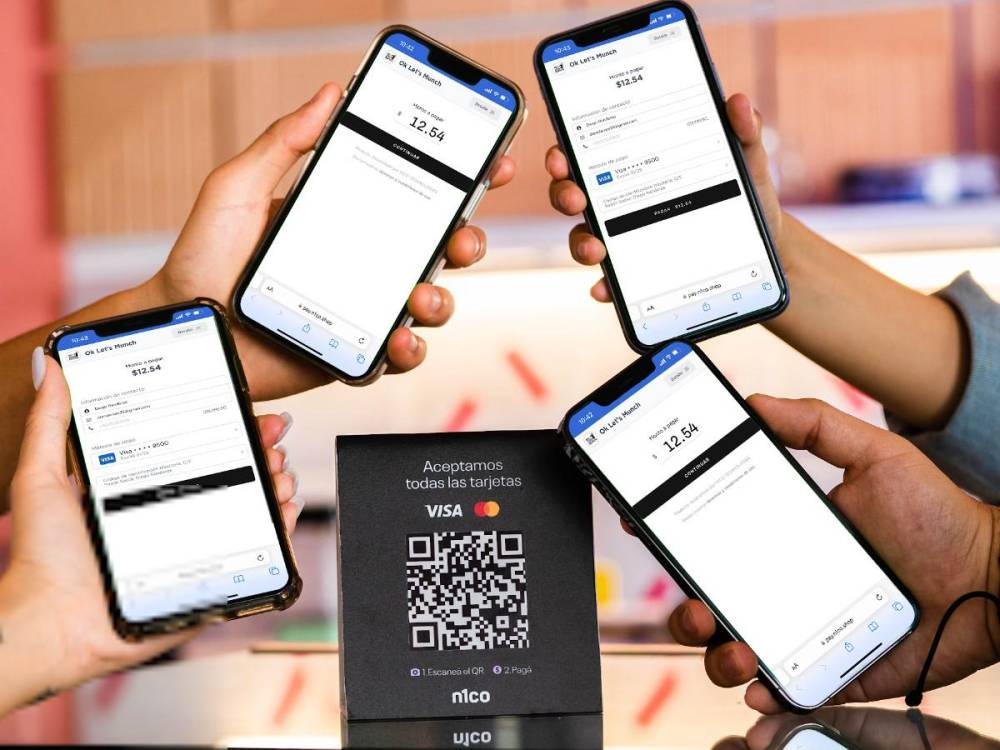

> **Led the end-to-end development** of FinTech services for the n1co app, achieving a **20% reduction in time-to-market** for new features by implementing **microservices and clean architecture** with C#, ASP.NET Core, Azure Service Bus Redis, Azure Functions, and Kubernetes.

My primary focus was on building robust and scalable backend systems that supported key functionalities, such as:

-   **KYC (Know Your Customer):** Developed secure and efficient processes for user identity verification and compliance with regulatory requirements.
-   **Digital Wallets:** Designed and implemented backend services for managing digital wallets, enabling features such as secure deposits, withdrawals, and real-time balances.
-   **Digital Card Issuing:** Engineered systems for issuing and managing both virtual and physical cards, including customization and logistics.
-   **Cashback and Loyalty Programs:** Created backend logic to support rewards programs, incentivizing user engagement and retention.

## **Key Achievements**

-   Developed a **KYC (Know Your Customer) module** that reduced user onboarding time by **65%** through streamlined workflows and automated validation processes using Webhooks, Serverless Functions, Logic Apps, External AI KYC providers, and Kubernetes.
-   Designed and deployed a **digital card issuance system** abstraction that increased card issuance capacity by **50%** using Clean Architecture principles, CQRS, async communication, and external bank gateway providers.
-   Designed and Implemented the **physical card issuance workflow** that increased geographical coverage by **70%** of the national territory with SOLID principles, strong REST and GraphQL API design, integration with delivery providers, and defensive programming.
-   **Enhanced the backend performance** of core FinTech services, resulting in a **25% decrease in API response times** by refactoring critical modules and implementing **caching solutions** using Redis and ASP.NET Core.
-   **Led the design and implementation** of a **payment reconciliation system** that processed **100,000+ transactions daily** with an accuracy rate of **99.9%** by leveraging **microservices**, Azure Service Bus, and SQL Server.

## **Impact**  

This role honed my expertise in managing complex FinTech projects, coordinating multidisciplinary teams, and delivering high-quality solutions under tight deadlines. The services developed for the n1co app significantly improved user experiences, streamlined financial operations, and ensured compliance with industry regulations.
