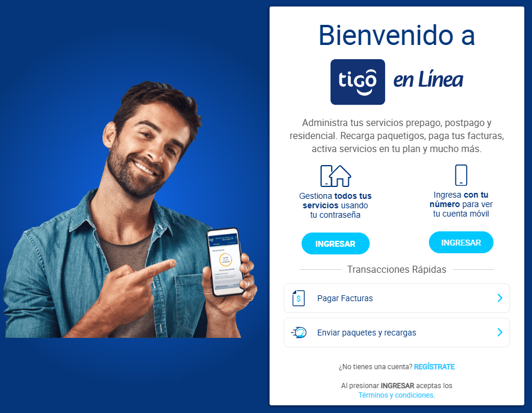

## **Lead Developer: Public Website, eCommerce, and Customer Portal for Tigo Guatemala**

**Description:**  
I spearheaded the design and development of the **public website, eCommerce platform, and customer portal** for Tigo Guatemala, one of the leading telecommunications providers in Central America. The project involved creating a dynamic, user-friendly, and scalable digital experience that catered to millions of users while meeting business objectives and enhancing customer engagement.

**Key Contributions:**

-   **Public Website Development:** Designed and implemented a responsive, high-performance website using **Drupal** and **PHP**, ensuring intuitive navigation and seamless content management for internal teams.
-   **eCommerce Platform:** Built an integrated eCommerce solution for purchasing plans, devices, and services, complete with secure payment gateways and real-time inventory updates.
-   **Customer Portal:** Developed a robust self-service customer portal, enabling users to manage accounts, pay bills, track usage, and access support efficiently.
-   **Scalability and Performance:** Optimized the platform to handle high traffic volumes during peak periods, ensuring a smooth experience for all users.
-   **Cross-Platform Compatibility:** Ensured compatibility across devices and browsers, leveraging **JavaScript** and **Node.js** for enhanced interactivity and dynamic content delivery.
-   **Integration with Backend Services:** Integrated with **Java-based backend systems** to enable real-time updates, secure data exchanges, and efficient service delivery.

**Key Achievements:**

-   Launched a customer-facing digital platform that improved user satisfaction and increased online engagement by over 30%.
-   Reduced page load times by 40% through performance optimization, improving user experience and SEO rankings.
-   Streamlined the eCommerce checkout process, resulting in a significant boost in online sales and reduced cart abandonment rates.
-   Ensured compliance with accessibility standards and implemented multilingual support to serve a diverse user base.

**Impact:**  
The revamped website, eCommerce platform, and customer portal significantly enhanced Tigo Guatemala’s digital presence, driving customer satisfaction and business growth. My leadership in this project ensured the delivery of a scalable, secure, and user-friendly digital ecosystem.
