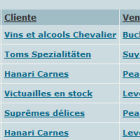
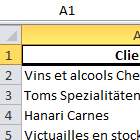
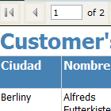
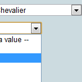

Today I published the **LLBLGen ANGTE** project. That is the short for **LLBLGen ASP.Net GUI Templates Extended** but that seems just too long

It’s a template set you can use in your LLBLGen projects to generate a complete database editor in ASP.NET 2.0+ using Adapter or SelfServicing generated code.

Since LLBLGen Pro v3.x now supports multiple target frameworks, it’s important to note that these templates only work for LLBLGen Pro target framework. That means you can’t use them to generate GUI for NHibernate, EntityFramework, etc., at least not for now.

## Why the word extended?

This template set is based on the original **ASP.NET GUI generator templates (Adapter/SelfServicing/ C#)** released by **Solutions Design** (creators of [LLBLGen Pro](http://llblgen.com/)). You can download the original templates [here](http://llblgen.com/Pages/ListAdditionalDownloads.aspx#4).

The additions to the project were asked to me by the **Spanish Ministry of Finances (MEH)**. They kindly asked me to release these additions as an Open Source project so the LLBLGen Pro community can benefit of them and collaborate.

## What is new/changed?

They are many little changes, the major relevant additions are:

- **.llblgengui file.** Now you don’t keep the GUI information at your LLBLGen project’s Custom Properties. Now you write an xml file containing such information.

- **DescriptiveField** is used anywhere now. The original templates just used the DescriptiveField of related entities to show a DropDownList in the FormView’s Insert/Edit modes. Now you see it at GridViews, FormViews and ListSubset search form.

- **TypedLists/TypedViews**are now supported. A ListSubSet search form is also generated for this.

- **Export to excel** button on all list forms.

- **ASP.Net validation**. Now you can put validation information in the GUI information file to be placed in forms at generation time.

- **Activate/Deactivate** the stuff that is generated, such add, edit, delete or export code.

- **CustomFormat**. You can indicate how some fields should be formatted.

- **Report templates**. Basic SSRS reports (.rdlc) are generated for each entity/typedView/typedList. You also can perform a search and show the results as a .rdlc report.

## Where are they?

The templates are [published on CodePlex](http://llblgenangte.codeplex.com/). So if you want to give it a try, post a comment, report issues, contribute or create your own fork, you are welcome.

Tags: [Adater](https://web.archive.org/web/2012/http://www.llblgening.com/archive/tag/adater/), [GUI](https://web.archive.org/web/2012/http://www.llblgening.com/archive/tag/gui/), [SelfServicing](https://web.archive.org/web/2012/http://www.llblgening.com/archive/tag/selfservicing/)

				<p class="
